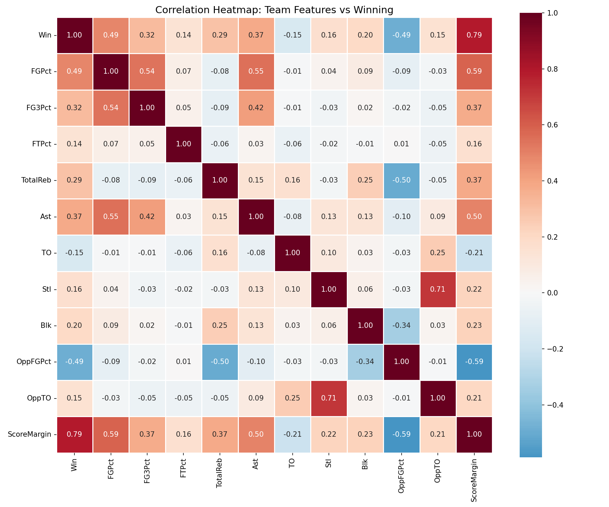
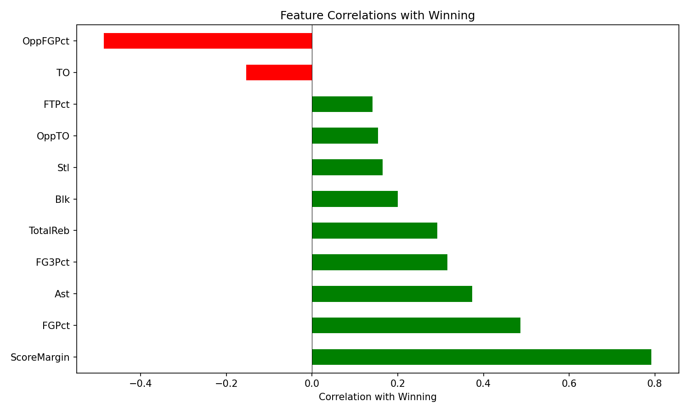
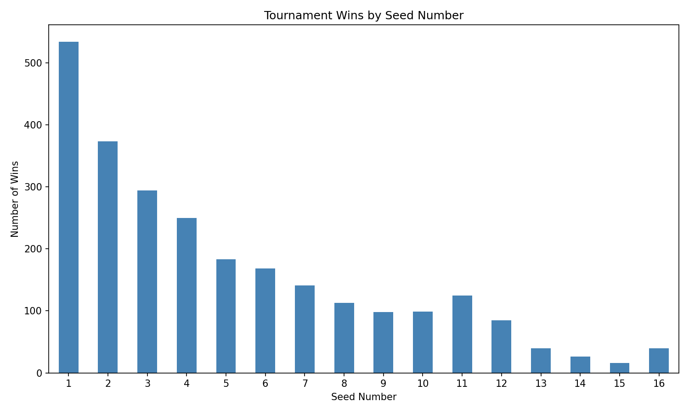
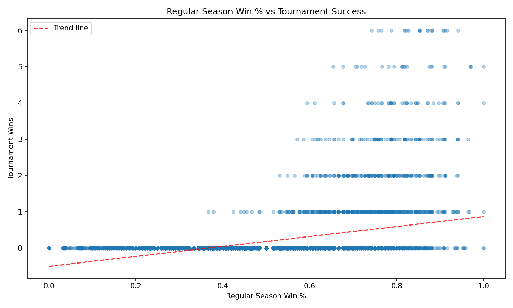
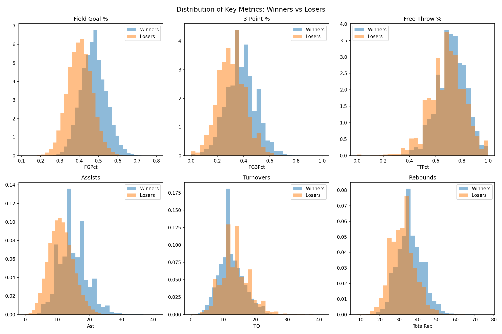
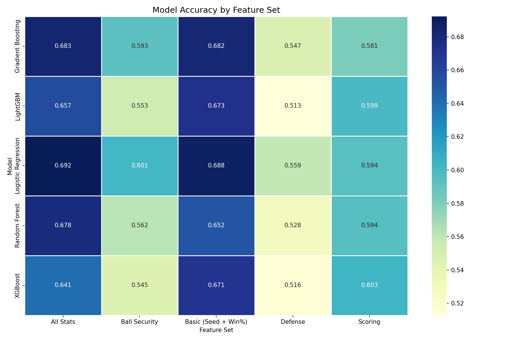
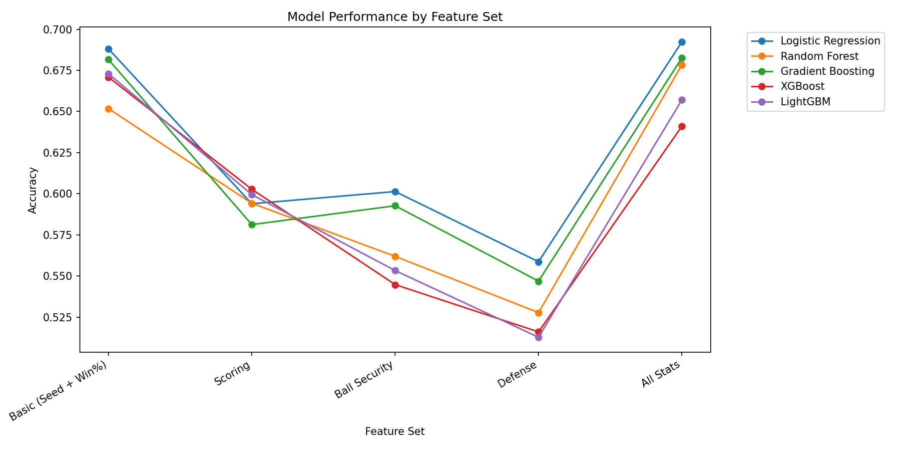
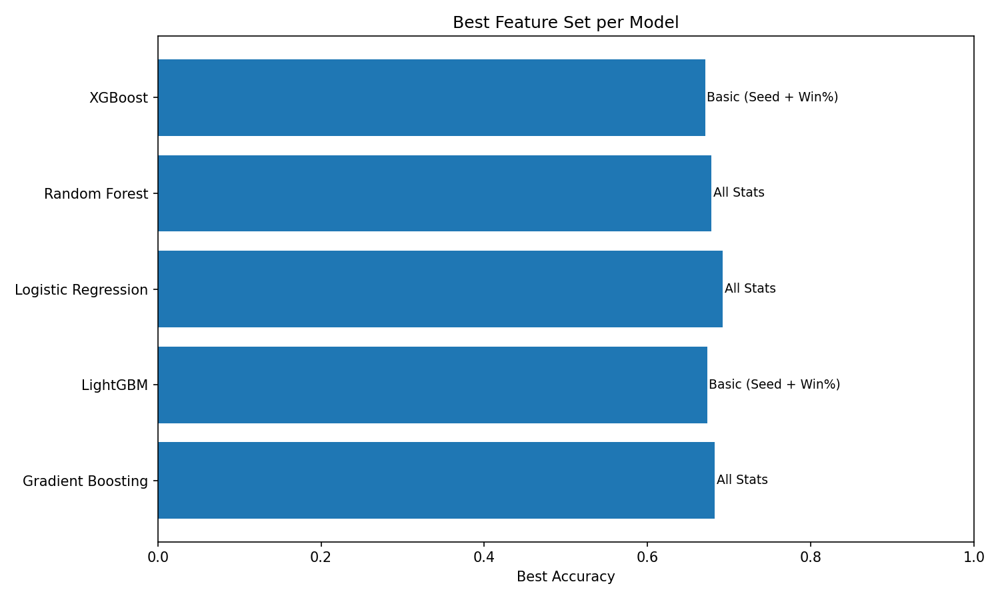

# ai_plotter.py

Analysis script for March Madness NCAA tournament data. Generates visualizations for feature correlation analysis and ML model comparisons.

## What It Does

- **Data Loading**: Loads men's and women's team data, seeds, tournament results, regular season stats, rankings, and conference data
- **Feature Engineering**: Creates winner/loser features from game data and computes team season statistics (win percentage, shooting percentages, rebounds, assists, turnovers, etc.)
- **Visualizations**: Generates plots showing correlation between features and winning, tournament success by seed, and distributions of key metrics
- **ML Comparison**: Tests multiple models (Logistic Regression, Random Forest, Gradient Boosting, XGBoost, LightGBM) across different feature sets using time-series cross-validation

## Usage

```bash
# Generate correlation and basic analysis plots
python ai_plotter.py

# Run ML model comparison
python ai_plotter.py ml
```

## Generated Plots

### correlation_heatmap.png
Shows correlation between team features (field goal %, 3-point %, free throw %, rebounds, assists, turnovers, steals, blocks) and winning.



### feature_correlations.png
Bar chart showing correlation strength of each feature with winning outcome.



### wins_by_seed.png
Tournament wins grouped by seed number (1-16), showing the inverse relationship between seed and success.



### winpct_vs_tourney.png
Scatter plot of regular season win percentage vs tournament wins, with trend line.



### key_metrics_dist.png
Histograms comparing distributions of key metrics (FG%, 3P%, FT%, assists, turnovers, rebounds) for winners vs losers.



### model_feature_heatmap.png
Heatmap comparing accuracy across 5 models and 5 feature sets (Basic, Scoring, Ball Security, Defense, All Stats).



### model_feature_lines.png
Line chart showing model performance trends across different feature sets.



### best_features_per_model.png
Bar chart showing the best-performing feature set for each model.

